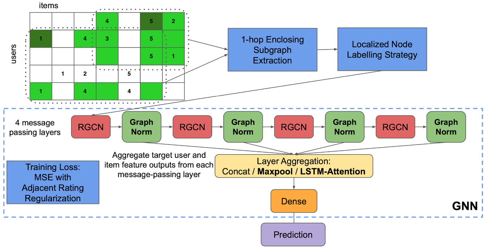
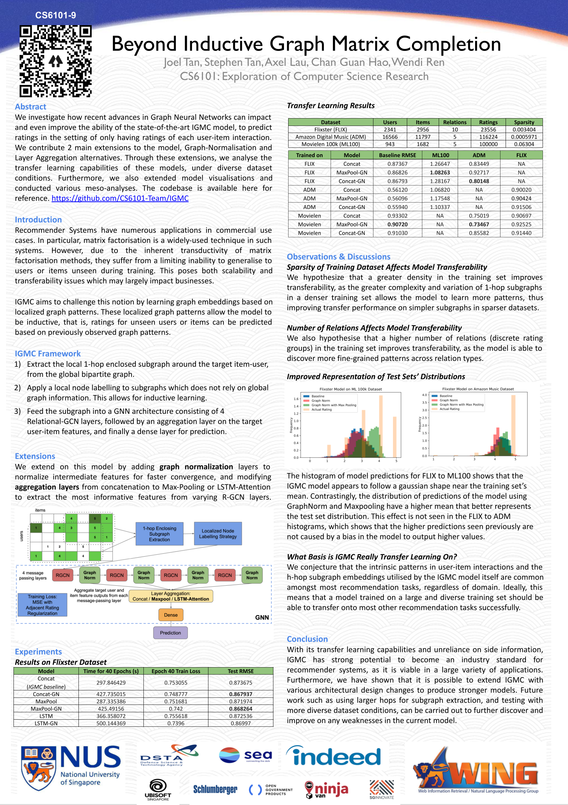

Beyond IGMC
===========

About
-----
This codebase refers to our project for the NUS SoC Module, CS6101 - Conversational Recommendation Systems, taken in AY20/21 Sem 2. We investigate how recent advances in Graph Neural Networks can impact and even improve the ability of the state-of-the-art Inductive Graph-based Matrix Completion (IGMC) model, from the following paper: https://openreview.net/pdf?id=ByxxgCEYDS.

We contribute 2 main extensions to the model, Graph Normalization, inspired from the following paper: https://arxiv.org/pdf/2009.03294.pdf, and alternative layer aggregation methods, inspired from the following paper: https://arxiv.org/pdf/1806.03536.pdf.

Through these extensions, we analyse the transfer learning capabilities of these models, under diverse dataset conditions. Furthermore, we also extended model visualisations and conducted various meso-analyses.

The full details of our experimental results, discussions, and findings are given in our project report. The links to our project report, poster, and promotional video are all available in the following link: https://linktr.ee/BeyondIGMC.

Poster
------

Usage
-----
Our model is run in similar fashion to the original IGMC codebase, which you may refer to for more details. We have included several new parameters which can be used pertaining to our model extensions.

Acknowledgement & Reference
----------------------------
IGMC: Zhang, M., & Chen, Y. (2019). Inductive matrix completion based on graph neural networks. arXiv preprint arXiv:1904.12058.

Cai, T., Luo, S., Xu, K., He, D., Liu, T. Y., & Wang, L. (2020). Graphnorm: A principled approach to accelerating graph neural network training. arXiv preprint arXiv:2009.03294. 

Xu, K., Li, C., Tian, Y., Sonobe, T., Kawarabayashi, K. I., & Jegelka, S. (2018, July). Representation learning on graphs with jumping knowledge networks. In International Conference on Machine Learning (pp. 5453-5462). PMLR.

This project is forked from the original IGMC Codebase: https://github.com/muhanzhang/IGMC

GraphNorm code inspired from the original GraphNorm Codebase: https://github.com/lsj2408/GraphNorm
